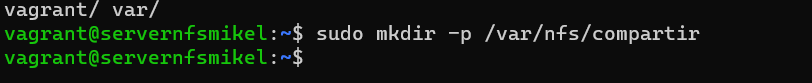

# Pila LEMP de 3/4 Capas - Miguel Cordero González

# Índice

1. [Introducción](#introducción)
2. [Creación de servidores](#pasos-a-seguir-para-crear-los-servidores)
    * [Balanceador](#servidor-balanceador)
    * [Servidor NFS](#nfs-server)
    * [Servidores WEB](#servidores-web1-y-web2)
    * [Servidor BBDD](#ddbb)

# Introducción

En este proyecto, se implementa una pila LEMP y la instalación de WordPress.

Capa 1: Balanceador.

Capa 2: WEB1 y WEB2.

Una máquina que aloja un servidor NFS y PHP-FPM.

Capa 3: Servidor Base de Datos.

Se emplea una base de datos MariaDB.

La web 1 y web 2 no están accesibles desde una red pública.

Los servidores web utilizarán una carpeta compartida proporcionada por NFS.

# PASOS A SEGUIR PARA CREAR LOS SERVIDORES.

## Servidor Balanceador

Para la configuración del balanceador.

- Utilizaremos aprovisionamiento que permitirá ahorrar bastante tiempo en la configuración. Este proceso incluirá Nginx, su arranque y la eliminación de archivos que no son necesarios.

 ```
sudo apt update
sudo apt install -y nginx
systenctl start nginx
systemmctl enable nginx

 ```

- Una vez iniciada la máquina, accederemos al directorio **/etc/nginx/sites-enabled** y crearemos el archivo llamado "balanceador".
- En este archivo, añadiremos el siguiente código:

 ```
upstream servidoresweb {
    server (direccion IP de servidor web1)
    server (direccion IP de servidor web2)
}
	
server {
    listen      80;
    server_name balanceador;

    location / {
	    proxy_redirect      off;
	    proxy_set_header    X-Real-IP \$remote_addr;
	    proxy_set_header    X-Forwarded-For \$proxy_add_x_forwarded_for;
        proxy_set_header    Host \$http_host;
        proxy_pass          http://servidoresweb;
	}
}
 ```

 

 

# NFSserver

- Para el servidor nfs, llevaremos a cabo el siguiente aprovisionamiento.

```
sudo apt update
sudo apt install -y nfs-kernel-server
sudo apt install -y nfs-common
sudo apt install -y php-mysql

```

- Crearemos el siguiente directorio.

 

- Después, accedemos al archivo /etc/exports y añadimos las siguientes líneas para permitir hacer un mount de las carpetas.

```
/var/nfs/compartir/wordpress     X.X.X.X(rw,sync,no_root_squash,no_subtree_check)
/var/nfs/compartir/wordpress     X.X.X.X(rw,sync,no_root_squash,no_subtree_check)

```

 

 

- Una vez editado, nos vamos a /var/nfs/compartir/wordpress.
- Descargaremos el siguiente archivo de WordPress.

 ```
sudo wget https://wordpress.org/latest.tar.gz
sudo tar -xzvf latest.tar.gz

```

- Ahora habilitaremos los puertos de los servidores para evitar problemas con las conexiones nfs.

 

- En la carpeta en la que descargamos WordPress, editaremos el archivo (wp-config-sample).

 

 

- Ahora le asignaremos los permisos.

 

# Servidores WEB1 Y WEB2

- Para los servidores web1 y web2, utilizaremos el siguiente aprovisionamiento.

```
sudo apt-get update
sudo apt-get install -y nginx
sudo apt-get install -y nfs-common
sudo apt-get install -y php-fpm
sudo apt-get install -y php-msyql

```


- Para montar el directorio anteriormente creado en el NFS.

```
sudo mount X.X.X.X:/var/nfs/compartida/wordpress /var/nfs/compartida/wordpress
```
 

 

 
- Ahora iremos al directorio (/etc/nginx/sites-available) y crearemos una copia del archivo "default".


- Modificamos las siguientes líneas.


 


- Una vez editado el archivo, Borramos el archivo default y dejamos el del wordpress.

```
sudo ln -s /etc/nginx/sites-available/wordpress /etc/nginx/sites-enabled.
```
 

# DDBB

- Este será el aprovisionamiento de servidor de datos.

```
sudo apt-get update
sudo apt-get install -y mariadb-server
```

- Una vez arranquemos la máquina, iremos al directorio (/etc/mysql/mariadb) y editaremos el archivo "50-server", cambiando en la línea "bind-address".

 

- Una vez realizado ese cambio, crearemos la base de datos, el usuario y los permisos correspondientes para el posterior acceso.


 
 


- Para la comprobar que esta funcionando la pagina web, iremos a nuestro navegador escribiremos "localhost:9000".

- Tambien tengo instaldo la pagina de base de datos porque no me funcionaba el wordpress pero al final si lo he solucionado.
